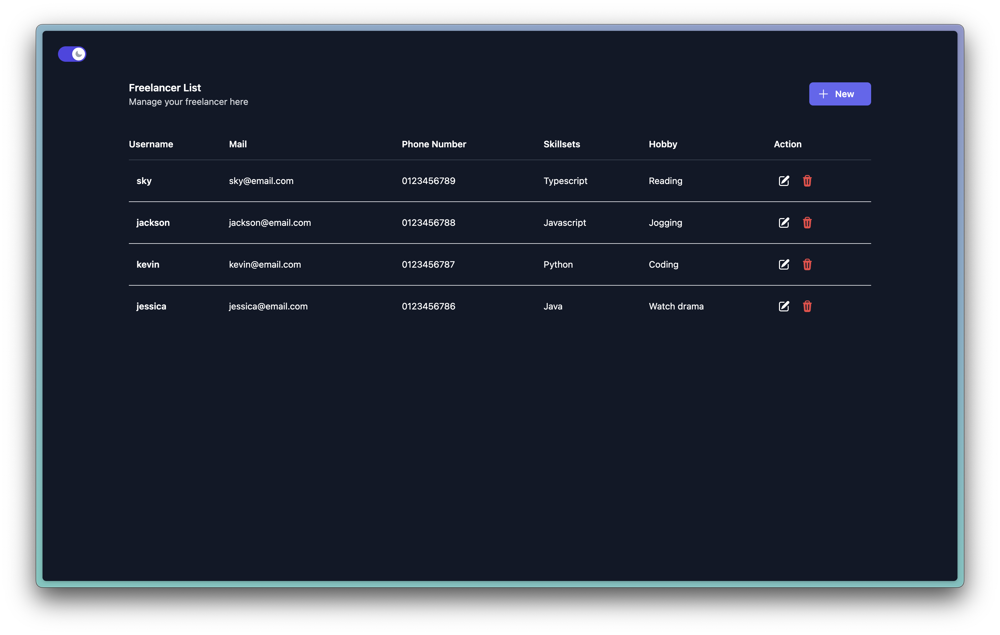

# Freelancer Management System

A simple web application for managing freelancers, built with Next.js, React, TypeScript, Tailwind CSS, and PostgreSQL.

## Screenshot

 Light Theme | Dark Theme
:-----------:|:----------:
 | 

## Features

- Add new freelancers
- Edit existing freelancers
- Delete freelancers
- View list of freelancers
- Each freelancers should have unique username, mail, and phone number
- Light/Dark theme
- Utilizes Vercel PostgreSQL for data storage

## Technologies Used

- Next.js
- React
- TypeScript
- Tailwind CSS
- PostgreSQL
- Drizzle Kit

## Models

### Database Model

The database model for the user entity is created using Drizzle ORM. It defines the structure of the data stored in the PostgreSQL database. The model includes fields such as `id`, `name`, `mail`, `phoneNumber`, `skillsets`, and `hobby`. This file will be kept under the directory of `src/data/db/schemas`.

```typescript
import { InferType, date, object, string } from "yup";

export const UserSchema = object({
	id: string().uuid(),
	username: string().required(),
	mail: string().email().required(),
	phoneNumber: string()
		.matches(/^(60|0)(1|11)\d{8}$/g, "Please enter a valid phone number")
		.required(),
	skillsets: string(),
	hobbies: string(),
	createdAt: date(),
	updatedAt: date()
});

export type User = InferType<typeof UserSchema>;
```

### Form Validation Model

The form validation model is created using Yup. It defines the validation schema for adding or editing a user. The model ensures that the required fields are present and that the phone number is in a valid format.

```typescript
import { InferType, date, object, string } from "yup";

export const UserSchema = object({
	id: string().uuid(),
	username: string().required(),
	mail: string().email().required(),
	phoneNumber: string()
		.matches(/^(60|0)(1|11)\d{8}$/g, "Please enter a valid phone number")
		.required(),
	skillsets: string(),
	hobbies: string(),
	createdAt: date(),
	updatedAt: date()
});

export type User = InferType<typeof UserSchema>;
```

## Deployment

The application is deployed on Vercel and is publicly accessible at [https://freelancers-management-system.vercel.app/](https://freelancers-management-system.vercel.app/).

## Getting Started

To get a local copy up and running follow these simple steps.

### Prerequisites

- Node.js
- npm

### Installation

1. **Clone the repo**
   ```sh
   git clone https://github.com/sky3742/freelancers-management-system.git
   ```
   
2. **Install NPM packages**
   ```sh
   npm install
   ```

3. **Copy the `.env.example` to `.env`**
   ```sh
   cp .env.example .env
   ```

4. **Update the `.env` file with your PostgreSQL connection details**

   Update the following values in the `.env` file with your PostgreSQL connection details:

   ```sh
   POSTGRES_DATABASE=your_postgres_database
   POSTGRES_HOST=your_postgres_host
   POSTGRES_PASSWORD=your_postgres_password
   POSTGRES_URL=your_postgres_url
   POSTGRES_URL_NON_POOLING=your_postgres_url_non_pooling
   POSTGRES_URL_NO_SSL=your_postgres_url_no_ssl
   POSTGRES_USER=your_postgres_user
   ```

5. **Start the development server**
   ```sh
   npm run dev
   ```

6. **Open your browser and navigate to** `http://localhost:3000`

## Usage

1. Click on the "New" button to add a new freelancer.
2. Click on the pencil icon to edit a freelancer.
3. Click on the trash icon to delete a freelancer.


## Migrating Vercel PostgreSQL

To migrate your Vercel PostgreSQL database, follow these steps:

1. **Generate SQL Migration Files**

   Run the following command to compare and generate the differences in the model schema into SQL files in the `drizzle` folder:

   ```sh
   npm run db-generate
   ```

2. **Run Migration**

   Once the SQL migration files are generated, run the following command to utilize the built-in `migrate` function from `vercel-postgres/migrator` to migrate the database using the SQL files in the `drizzle` folder:

   ```sh
   npm run db-migrate
   ```

3. **Open Database Viewer**

   To open the database viewer provided by Drizzle Kit, run the following command:

   ```sh
   npm run db-studio
   ```

4. **Verify Migration**

   After the migration is complete, verify that the migration was successful by checking your database schema and ensuring that your data is intact.

## Known Issue

### Cold Start of Vercel PostgreSQL

When the Vercel PostgreSQL database is idle, the initial deployment may fail due to connection timeout issues. This is because the database needs to "wake up" from its idle state. [Reference](https://vercel.com/docs/storage/vercel-postgres/limits#vercel-postgres-cold-starts)

#### Solution

To resolve this issue, you will need to ping the database before the deployment. This will "wake up" the database and ensure that the deployment succeeds. 

## Contact

Sky - skyblue3742@gmail.com
